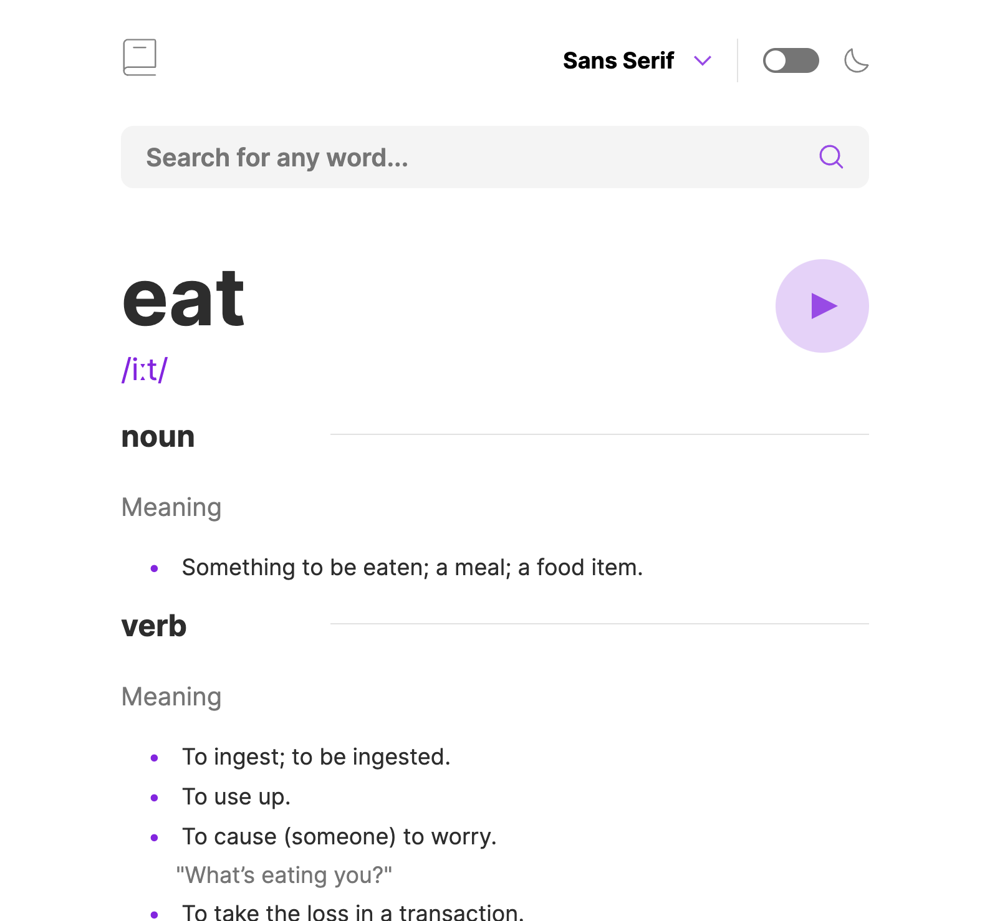
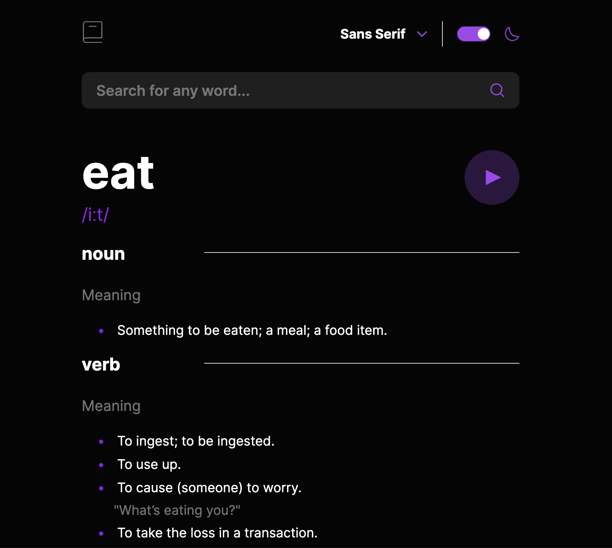

# Frontend Mentor - Dictionary web app solution

This is a solution to the [Dictionary web app challenge on Frontend Mentor](https://www.frontendmentor.io/challenges/dictionary-web-app-h5wwnyuKFL). Frontend Mentor challenges help you improve your coding skills by building realistic projects. 

## Table of contents

- [Overview](#overview)
  - [The challenge](#the-challenge)
  - [Screenshot](#screenshot)
  - [Links](#links)
  - [How to run](#how-to-run)
- [My process](#my-process)
  - [Built with](#built-with)
  - [What I learned](#what-i-learned)
  - [Continued development](#continued-development)
  - [Useful resources](#useful-resources)

## Overview

### The challenge

Users should be able to:

- Search for words using the input field
- See the Free Dictionary API's response for the searched word
- See a form validation message when trying to submit a blank form
- Play the audio file for a word when it's available
- Switch between serif, sans serif, and monospace fonts
- Switch between light and dark themes
- View the optimal layout for the interface depending on their device's screen size
- See hover and focus states for all interactive elements on the page
### Screenshot

Light Mode version:


Dark Mode version:


### Links

- Solution URL: [https://www.frontendmentor.io/solutions/dictionary-web-app-MSI4v4i_z8](https://www.frontendmentor.io/solutions/dictionary-web-app-MSI4v4i_z8)
- Live Site URL: [https://thomss23.github.io/dictionary-lit-web-components/](https://thomss23.github.io/dictionary-lit-web-components/)

### How to run
```cd``` into ```dictionary-lit-web-components``` and run
```
npm i
npm run serve
```
The app should load on ```localhost:8000```

## My process

### Built with

- HTML 5  
- CSS
- Flexbox
- Mobile-first workflow 
- [Lit 3](https://lit.dev/) - JS library

### What I learned

The purpose of this project was to get better understanding about [Web Components](https://developer.mozilla.org/en-US/docs/Web/API/Web_components) and dive deep into the Lit framework, understanding its core concepts and best practices.

Throughout the development of this side project, I've immersed myself in the dynamic world of Lit components, uncovering the nuances of state management, data fetching from REST APIs, and the art of updating component states seamlessly. Additionally, delving into the realm of styling, event listening, and understanding the exposure of ES6 classes in the context of Lit components has broadened my toolkit for creating robust and efficient web applications. This journey has not only deepened my understanding of Lit components but has also provided valuable insights into the broader landscape of modern web development


### Continued development

My next goal is to enhance this project with a comprehensive suite of unit tests.
This journey will not only strengthen the reliability of the code but also provide a fantastic opportunity for me to delve into the intricacies of testing in the context of web components. 

### Useful resources

- [https://developer.mozilla.org/en-US/docs/Web/API/Web_components](https://developer.mozilla.org/en-US/docs/Web/API/Web_components) - A good intro into the world of web components.

- [https://lit.dev/docs/](https://lit.dev/docs/) - Their docs are actually the best place to get started and I really recommend going through the interactive tutorials.

- [https://open-wc.org/](https://open-wc.org/) - Further readings on web components

